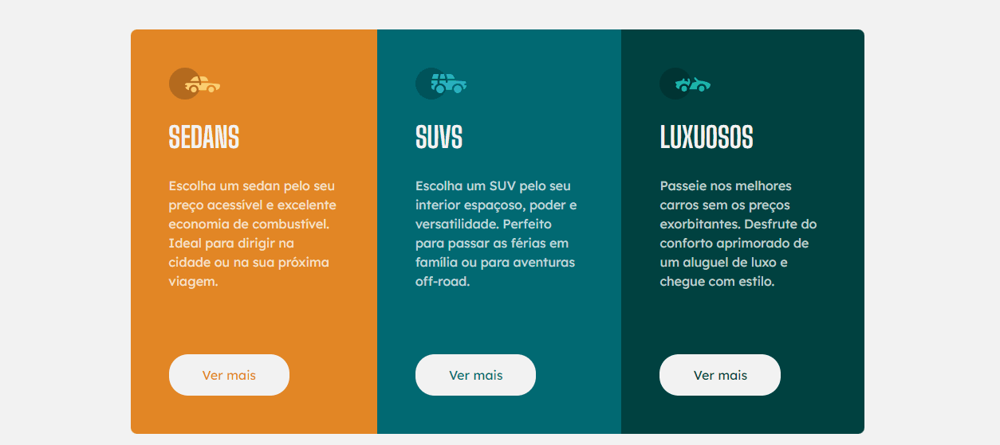

<h1 align="center">
    🚗 ReactJS + Tailwind Project
</h1>

This is a simple project that allows you to work with basic React concepts such as components, images, styles, etc., using the Tailwind CSS framework for styling..

    </img>
    </img>

## 🚀 Key Features 

**React Components:** Use components to organize and reuse code efficiently.
  
- **Image Handling:** Load and display images in your React application.

- **Styling with Tailwind CSS:** Apply styles quickly and responsively using classes provided by Tailwind CSS.

## Prerequisites

Before you start, make sure you have Node.js and npm (or yarn) installed in your development environment.

## Technologies Used 💻

- ✅ ReactJS

- ✅ Tailwind CSS

- ✅ Node.js

- ✅ npm (or yarn)

Made with ♥ by MATHEUS PC  [Get in Touch!](https://www.linkedin.com/in/matheus-estevan-38018a297)